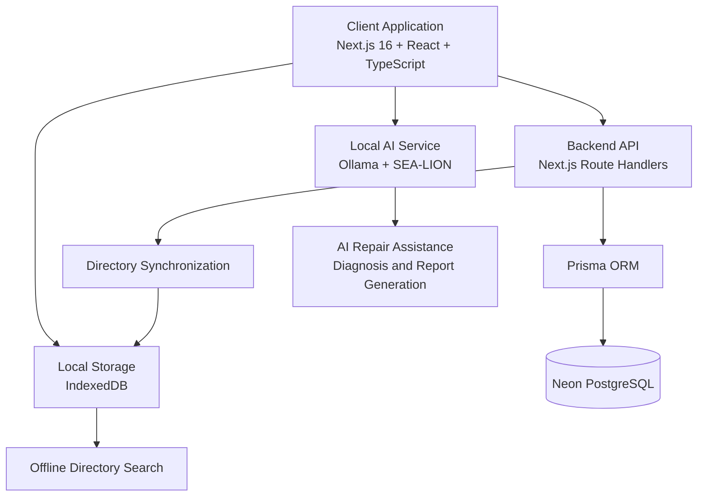

## 🏗️ System Architecture

repAIrmate follows an **offline-first architecture** that combines locally hosted AI, a web-based client application, cloud database storage, and browser-based local storage. This enables users to access previously synchronized professional directory records and perform supported searches even without an internet connection.

### Technology Stack

| Layer                       | Description                                                                                                           | Technology                                                     |
| --------------------------- | --------------------------------------------------------------------------------------------------------------------- | -------------------------------------------------------------- |
| **On-device AI**            | Runs a local language model for repair assistance, preliminary diagnosis, and report generation.                      | Ollama + `aisingapore/Gemma-SEA-LION-v4.5-E2B-IT`              |
| **Client Application**      | Provides the AI chat interface, repair report viewer, and professional directory search.                              | Next.js 16, React, TypeScript, Tailwind CSS, shadcn/ui, Lucide |
| **Local Storage**           | Stores synchronized professional directory records in the browser for offline access and search.                      | IndexedDB                                                      |
| **Backend API**             | Handles chat requests, professional directory operations, and server-side application logic.                          | Next.js Route Handlers, Node.js                                |
| **Database**                | Stores professional profiles, trade specialties, service areas, and other persistent application data.                | PostgreSQL, Neon, Prisma ORM                                   |
| **Offline Synchronization** | Synchronizes professional directory records from the backend to local browser storage when connectivity is available. | Custom Next.js Directory Sync + IndexedDB                      |

### Architecture Diagram

### Core Components

- **On-device AI:** Uses Ollama to run the SEA-LION language model locally, enabling AI-powered repair assistance without relying on a cloud-based AI provider.
- **Client Application:** Provides the main user interface for describing home repair problems, viewing generated reports, and searching for local professionals.
- **Local Storage:** Uses IndexedDB to retain previously synchronized professional directory records on the user's device.
- **Backend API:** Processes application requests and communicates with the database through Prisma ORM.
- **Database:** Uses Neon-hosted PostgreSQL for persistent storage of professional profiles and related application data.
- **Offline Synchronization:** Downloads professional directory records from the backend and stores them locally for subsequent offline access.

### Offline-First Features

- **Local AI processing:** Repair assistance and report generation can run locally when Ollama and the required model are available.
- **Offline directory access:** Previously synchronized professional records remain available in IndexedDB.
- **Offline search:** Users can search cached professional records without making a server request, provided the search logic supports local data.
- **Online synchronization:** Directory records can be refreshed from the backend when internet connectivity is restored.

> **Note:** repAIrmate supports offline functionality for features implemented locally. Cloud database operations, live professional matching, new registrations, and other server-dependent features generally require internet connectivity. Local AI requires Ollama and the model to be installed and running on the device.

### Architecture Design Principle

repAIrmate combines **local AI processing, browser-based offline storage, and centralized professional data management** to make home repair assistance more accessible, especially for users with intermittent internet connectivity.
